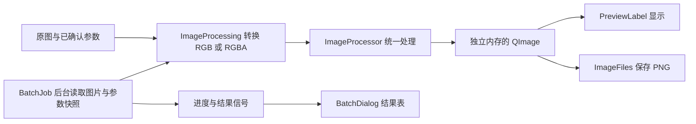

# 图像处理组合与模块设计

日期：2026-10-04

本文记录我对单张图片组合处理的需求、模块划分和验收结果，供后续维护与批量任务复用使用。当前状态：实现完成，Release 构建和自动检查通过，真实设备操作仍需手动验收。

## 需求与处理规则

我需要让裁剪旋转、尺寸、背景、颜色、灰度、亮度和对比度组合生效。修改任一参数时保留其他参数，每次从原图重新计算，避免重复处理造成亮度累加或尺寸取整误差。

| 参数 | 默认值 | 范围与含义 |
| --- | --- | --- |
| grayscale | false | 是否转为灰度 |
| targetSize | 空尺寸 | 空尺寸保持几何处理后的尺寸；指定尺寸必须为正，最多输出 4000 万像素 |
| brightness | 0 | -100～100，增加或减少像素值 |
| contrast | 1.0 | 0.5～2.0，乘以通道像素值 |

固定顺序是翻转／旋转与裁剪、尺寸、背景、颜色、灰度化、亮度与对比度。最后一步使用输出像素 = 输入像素 × 对比度 + 亮度，8 位输出限制在 0～255。

我选择固定顺序，使操作的先后不影响同一组参数的最终结果。先调亮度再转灰度，和先转灰度再调亮度，只要最终参数相同，都调用同一流程。

## 模块职责

| 模块 | 负责内容 | 依赖边界 |
| --- | --- | --- |
| ImageProcessor::Options | 保存全部参数，判断是否为原图状态 | OpenCV 基础类型，不依赖 Qt 控件 |
| ImageProcessor | 校验、几何、背景、颜色、灰度、尺寸与色调运算 | OpenCV，不读取文件、不弹窗 |
| segmentHuman | PPHumanSeg 本地人物识别，各线程分别缓存 Net | OpenCV DNN，只读模型字节，不访问窗口 |
| ImageProcessing | QImage 与 RGB／RGBA cv::Mat 转换、输出内存复制 | Qt 图像类型与处理模块，不访问控件 |
| ToneDialog、ResizeDialog、GeometryDialog、BackgroundDialog | 编辑参数，确认或取消 | 不修改主窗口成员 |
| DialogAppearance、styles/dialog.qss | 参数对话框共用外观、按钮与系统拖动 | 不接触图像和参数 |
| PreviewLabel | 预览比例、拖动与裁剪 | 不改变处理参数 |
| MainWindow | 文件选择、窗口交互、编辑历史与结果提交 | 成功后才更新当前图片与参数 |
| ImageFiles | 单张与批量的新文件保存和自动编号 | 不覆盖已有文件，不访问控件 |
| BatchJob | 后台扫描、读取、处理、保存和取消 | QThread 通过信号通知界面 |
| BatchDialog | 输入输出目录、进度、结果列表和报告 | 使用参数快照，运行期间冻结配置 |

调用流程：原图 + Options → Qt 数据转换 → OpenCV 处理 → 独立内存的 QImage → 主窗口提交 → 预览或保存。

预览缩放只改变显示变换，与 targetSize 分离。结果 QImage 复制到 Qt 管理的内存，避免 cv::Mat 离开函数后留下悬空指针。

## 参数交互与失败处理

我保留原图和当前结果，另用一个 Options 对象保存已确认参数，去掉重复的灰度状态字段。

- 打开新图片时恢复默认参数。
- 灰度和尺寸操作复制已确认参数，只修改自己的字段。
- 亮度与对比度在独立对话框中预览，保留灰度和尺寸设置。
- 滑块与输入框同步，每次参数变化立即重算预览，拖动时不等待松手。
- 点击滑块轨道时，通过 Qt 的 SH_Slider_AbsoluteSetButtons 策略直接定位，再由 Qt 处理后续拖动和数值映射。
- “重置全部颜色调整”清除光线与颜色参数，保留几何和背景。
- 确认后重新计算完整结果，失败时保留旧图片和旧参数。
- 取消或关闭对话框时，主页图片与参数保持不变。
- “恢复原图”清除全部参数并恢复打开时的图片。

颜色对话框打开时，我先缓存保留几何、背景和尺寸比例的中性 RGB 预览，长边最多 1280 像素。拖动时只在该缓存上重新计算亮度和对比度，取消 75ms 计时器，避免持续拖动时反复推迟显示。预览缩略处理可能与完整结果的细节有差异；确认后，主窗口仍使用原图与完整参数重新计算。

颜色和几何预览在界面线程中执行，背景预览与批量任务在后台执行。首次生成预览和确认完整单张结果仍可能受大图耗时影响。

## 故障修复

边框光标原先设置在主窗口上，进入内部控件后没有清除。我在进入内容区、菜单栏或状态栏，以及离开主窗口时清除父窗口光标，恢复各控件自己的光标。

百分比框改为 112px 宽，清除内层输入框的重复内边距；外部更新文本后将游标移到起始位置，避免水平滚动裁切首位数字。截图已确认 200% 完整显示。

## 验证与操作

我验证了全部 16 种参数开关组合。RGB 纯红色转灰度应为 76；对比度 1.5、亮度 10 的灰度结果应为 124。还检查了上下界截断、默认参数不改变像素、原图不被修改，以及非法参数被拒绝。

普通与 200% 显示缩放下，离屏检查覆盖光标恢复、百分比文字宽度、四项参数组合、修改尺寸后保留色调参数、取消、重置、恢复原图、预览缩放、全屏返回和尺寸对话框确认／取消循环。

纯处理测试位于 ImageBatchTool/tests/imageprocessor_tests.cpp。在配置 CMake 时设置 IMAGEBATCHTOOL_BUILD_TESTS=ON，构建后通过 CTest 运行。Windows 测试运行时，OpenCV DLL 目录需要位于 PATH；本机为 D:/Tools/OpenCV/opencv/build/x64/vc16/bin。

手动验收：打开图片，调整尺寸，转灰度，再进入“颜色与光线”。移动滑块，确认前两项设置仍生效；测试确认、取消、重置和恢复原图。保存后重新打开结果，检查像素尺寸与处理效果。

## 打开目录与对话框验收（2026-10-04）

我使用 QSettings 保存最近一次成功打开图片的目录，键为 files/lastOpenDirectory，支持关闭程序后继续读取。首次打开或记录目录已被删除时，回退到系统图片目录；该目录不可用时使用用户主目录。取消或读取失败时不改写记录。

亮度与对比度对话框移除系统标题栏，与尺寸对话框复用同一份圆角、边框、阴影、头部关闭按钮及底部确认／取消样式。头部拖动由系统处理，Esc 和关闭按钮都执行取消。

我新增 ImageBatchTool/tests/dialog_interaction_tests.cpp，检查轨道点击位置、按住拖动过程中的像素即时更新、重置控件同步、灰度和尺寸保留、关闭取消，以及文件选择目录保存与再次打开。测试使用独立的临时设置文件，不修改日常程序的目录记录。通过 IMAGEBATCHTOOL_BUILD_TESTS=ON 构建，和纯处理测试一起由 CTest 执行。

本机离屏测试显式指定 Qt 开发环境的插件目录，避免部署目录中的 qt.conf 只提供 Windows 平台插件而导致测试启动失败。真实鼠标操作和系统原生文件选择框仍需手动验收。

## 编辑扩展后的数据流

日期：2026-10-04。新增参数、背景算法与批量限制见 [功能扩展与批量处理](功能扩展与批量处理.md)。

Alpha 与颜色分开处理，灰度输出在有透明通道时保持 RGBA；移除背景新增 Alpha。处理参数和画笔坐标可以复用到批量图片，撤销保存最多 50 组参数，不保存放大预览位图。
默认背景蒙版改为 PPHumanSeg 人像模型；模型从内置资源读取并校验，非人像可以选择通用区域模式。来源与本机证件照验证见[人像分割算法替换](人像分割算法替换.md)。
