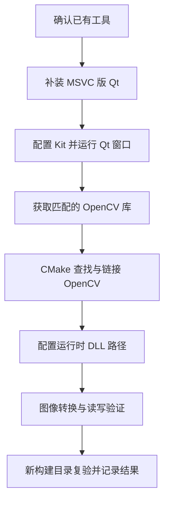

# Qt 6 + OpenCV 4 开发环境配置

- 文档版本：0.2
- 创建日期：2026-09-23
- 最后更新：2026-09-26
- 文档类型：开发环境操作说明
- 读者：本项目开发者，以及需要复现开发环境的读者
- 适用范围：Windows 64 位、Qt Widgets、CMake、MSVC 2022、OpenCV 4
- 当前状态：Qt 窗口已运行，OpenCV 已完成 CMake 查找与链接；OpenCV 运行验收待完成

## 1. 目标与执行顺序

我需要先验证 Qt 与 OpenCV 能在同一个工程中构建和运行，再开发图片处理工具。本阶段交付一套有版本和路径记录的环境，以及一个可重复构建的最小验证工程。

下图表示计划执行流程：



Qt Creator 是编辑、构建和调试工具；Kit 是 Qt、编译器和构建工具的一组配置；DLL 是程序运行时加载的动态库。CMake 负责生成构建规则，Ninja 执行这些规则。

## 2. 已有环境与方案选择

以下是截至 2026-09-26 在本机确认的环境记录。

| 组件 | 已检查的信息 | 尚未确认的部分 |
| --- | --- | --- |
| Qt | Qt 6.11.1 MSVC 2022 64 位组件已安装 | Qt 窗口已构建并运行 |
| Qt 维护工具 | `D:\Qt\MaintenanceTool.exe` 存在 | 组件列表的实际可选版本 |
| Visual Studio | 2022 Community，MSVC x64 工具链 | 已完成本工程 Release 构建 |
| Windows SDK | 存在 `10.0.22621.0` 头文件目录 | 已参与本工程构建 |
| CMake | `D:\Qt\Tools\CMake_64\bin\cmake.exe`，版本 3.30.5 | 已完成本工程配置 |
| Ninja | `D:\Qt\Tools\Ninja\ninja.exe` | 已用于本工程构建 |
| OpenCV | 4.13.0，`D:\Tools\OpenCV\opencv` | CMake 查找与链接已通过，运行验收待完成 |

已有 MinGW 版 Qt 可以用于对应的 Qt 工程。接入 OpenCV 时，需要让 Qt、OpenCV 和项目的编译工具链及架构匹配。

| 方案 | 所需工作 | 本次选择 |
| --- | --- | --- |
| 保留 MinGW 作为项目工具链 | 获取匹配的 OpenCV 构建，必要时自行编译 | 暂不采用 |
| 使用 MSVC 2022 | 补装 MSVC 版 Qt，获取兼容的 OpenCV Windows 库 | 优先执行，利用已有 C++ 工具组件 |

Qt 官方列出 Qt 6.11 对 MSVC 2022 和 64 位 Windows 的支持。实际配置仍需本机验收。[Qt Windows 支持说明](https://doc.qt.io/qt-6/windows.html)

## 3. 补装 Qt 并运行窗口

### 3.1 补装 MSVC 版 Qt

1. 在文件资源管理器中打开 `D:\Qt`，运行 `MaintenanceTool.exe`。
2. 按提示登录，选择“添加或删除组件 / Add or remove components”。
3. 展开 Qt 6.11.1，勾选“MSVC 2022 64-bit”对应组件，保留已安装组件。
4. 查看安装摘要，完成新增组件安装。
5. 检查是否生成 `D:\Qt\6.11.1\msvc2022_64\bin\qmake.exe`。

实际结果：`D:\Qt\6.11.1\msvc2022_64` 已存在，Qt Creator 已识别对应 Kit。

### 3.2 确认 Kit

重启 Qt Creator，在“首选项 / 选项 → Kits / 构建套件”中检查 MSVC 64 位套件。菜单名称以实际界面为准。

| 设置 | 预期选择 |
| --- | --- |
| Qt 版本 | 新安装的 MSVC 2022 64 位 Qt |
| C / C++ 编译器 | Visual Studio 2022，目标架构 x64 |
| CMake | 本机 CMake 3.30.5 |
| 构建工具 | Ninja |
| 调试器 | 可用的 Windows 调试器；缺失时记录为调试能力待配置 |

Kit 若有警告，读取具体提示。编译器错误会影响构建；缺少调试器可能影响调试，需要单独处理。

### 3.3 创建最小验证工程

在 Qt Creator 选择“新建项目 → Application → Qt Widgets Application”：

- 名称：`EnvironmentCheck`。
- 创建位置：本项目目录下的 `checks` 子目录，允许向导创建工程文件夹。
- 构建系统：CMake。
- 主窗口：保留向导默认的 `MainWindow`。
- Kit：上一步确认的 MSVC 64 位 Kit。
- 本轮构建配置：Release。

创建完成后运行工程，确认窗口出现。保留“编译输出”和“应用程序输出”，此时只将 Qt 窗口验证标记为通过。

实际工程路径：`D:\作业\简历\QtOpenCV批量图像处理工具\ImageBatchTool`。Release 配置已构建，窗口已正常运行。

## 4. 安装并接入 OpenCV

### 4.1 获取库并记录路径

从 [OpenCV 4.13.0 官方发布页](https://github.com/opencv/opencv/releases/tag/4.13.0) 查看 Assets，选择适用于 Windows 的预编译包。源码压缩包需要另外编译，不能直接作为已构建库使用。

本次使用 OpenCV 4.13.0 Windows 预编译包，安装目录为 `D:\Tools\OpenCV\opencv`。CMake 配置目录为 `D:\Tools\OpenCV\opencv\build`。

本机已将第三方库放入 `D:\Tools\OpenCV`。需要记录以下三类路径，目录层级以实际文件为准：

| 用途 | 定位依据 |
| --- | --- |
| CMake 配置目录 | 目录内含 `OpenCVConfig.cmake` |
| 头文件目录 | 目录内含 `opencv2` 文件夹 |
| 运行时库目录 | 目录内含本次构建所需的 OpenCV DLL |

本机使用 `D:\Tools\OpenCV\opencv\build` 作为 `OpenCV_DIR`。该配置已经通过 CMake 验证。

### 4.2 配置 CMake

打开验证工程的 `CMakeLists.txt`。在创建可执行目标之前加入：

```cmake
find_package(OpenCV 4 REQUIRED COMPONENTS core imgproc imgcodecs)
message(STATUS "Selected OpenCV: ${OpenCV_VERSION}")
```

在 `EnvironmentCheck` 可执行目标已创建的位置之后加入：

```cmake
target_include_directories(EnvironmentCheck PRIVATE ${OpenCV_INCLUDE_DIRS})
target_link_libraries(EnvironmentCheck PRIVATE ${OpenCV_LIBS})
```

保留向导原有的 Qt 链接配置。如果实际目标名称不同，将上述两处 `EnvironmentCheck` 改为实际名称。查找、头文件和链接分别用于定位库、编译源码和解析函数实现。[OpenCV CMake 示例](https://docs.opencv.org/4.13.0/db/df5/tutorial_linux_gcc_cmake.html)（其操作系统示例为 Linux，此处仅参考 CMake 接入方式。）

在 Qt Creator 的“项目 → 构建设置 → CMake”中添加 PATH 类型的 `OpenCV_DIR`，值为已确认含 `OpenCVConfig.cmake` 的目录，重新运行 CMake。

预期结果：配置输出显示所选 OpenCV 版本，且没有找不到库或不兼容的错误。机器专用路径记录在本地构建配置中。[Qt CMake 入门](https://doc.qt.io/qt-6/cmake-get-started.html)

### 4.3 配置运行时 DLL

在“项目 → 运行设置 → 运行环境”中，为现有 `PATH` 前置加入 OpenCV DLL 所在目录，使用分号与原内容分隔，并保留原来的全部路径。Qt 运行库路径由所选 Kit 提供，启动时仍需验证。

本轮使用 Release，应使用相应 Release 库；Debug 配置后续单独验证。开发环境的 PATH 设置用于本机运行，发布包仍需另做部署与独立机器测试。

## 5. 最小功能验证

在验证工程的 `main.cpp` 中，用下面代码替换该文件内容。本代码仅用于验证环境，不是产品功能实现；向导创建的其他文件可以保留。

```cpp
#include <QApplication>
#include <QDir>
#include <QLabel>
#include <QDebug>
#include <opencv2/core.hpp>
#include <opencv2/imgproc.hpp>
#include <opencv2/imgcodecs.hpp>

int main(int argc, char *argv[])
{
    QApplication app(argc, argv);
    try {
        // BGR 纯红色图，转换后的灰度值应约为 76。
        cv::Mat source(32, 32, CV_8UC3, cv::Scalar(0, 0, 255));
        cv::Mat gray;
        cv::cvtColor(source, gray, cv::COLOR_BGR2GRAY);
        if (!cv::imwrite("environment-check.png", gray)) {
            qCritical() << "Saving failed";
            return 1;
        }
        const auto loaded = cv::imread("environment-check.png", cv::IMREAD_GRAYSCALE);
        if (loaded.empty() || loaded.size() != gray.size()
            || loaded.type() != gray.type()
            || cv::norm(loaded, gray, cv::NORM_INF) != 0
            || loaded.at<uchar>(0, 0) != 76) {
            qCritical() << "Image verification failed";
            return 2;
        }
        qInfo() << "OpenCV" << CV_VERSION << "verification passed";
        qInfo() << "Output directory:" << QDir::currentPath();
        QLabel label("Qt + OpenCV environment check passed");
        label.resize(400, 100);
        label.show();
        return app.exec();
    } catch (const cv::Exception &error) {
        qCritical() << error.what();
        return 3;
    }
}
```

在运行设置中，将工作目录指定为一个有写入权限的专用验证输出目录，首次验证可用 `D:\QtOpenCVCheckOutput`，先在资源管理器中创建它。程序每次运行会覆盖该目录中的 `environment-check.png`，因此只在这个验证目录中运行。

预期结果：显示通过提示窗口；应用程序输出显示 OpenCV 版本和输出目录；生成 32×32 的灰度 PNG；保存后读取的数据与原灰度矩阵一致。该检查覆盖库调用、颜色转换和 PNG 读写，中文路径及真实图片兼容性在产品任务中另行验证。

**验证状态：Qt 窗口已经编译运行；本节 OpenCV 测试代码尚未在本机运行。**

## 6. 常见问题定位

| 现象 | 先检查什么 | 处理方向 |
| --- | --- | --- |
| 没有 MSVC Kit | Qt MSVC 组件是否安装，Qt Creator 是否识别工具链 | 重启识别，检查 Kit 各项路径 |
| 找不到 OpenCV 配置 | `OpenCV_DIR` 下是否有配置文件 | 修正目录，重新运行 CMake |
| 找不到 opencv2 头文件 | include 目录是否传给实际目标 | 核对目标名与 CMake 配置结果 |
| 链接失败 | 第一条链接错误、架构、编译器与配置 | 依据报错确认缺库或不匹配，不随机换库 |
| 启动提示缺少 DLL | 运行环境 PATH、实际 DLL 文件 | 加入对应运行库目录，重新启动 |
| Qt 平台插件加载失败 | 是否混入其他 Qt 版本的路径或插件 | 检查 Kit 和运行环境的 Qt 来源 |
| 图片保存失败 | 工作目录权限、编码器、异常输出 | 使用专用可写目录，检查具体错误 |

切换编译器或 Qt 组件后，为新组合选择新的构建目录，保留旧目录中的日志供对比。

## 7. 验收与记录

| 验收项 | 本次状态 |
| --- | --- |
| MSVC 版 Qt 与 Kit 配置完成 | 已通过 |
| Qt 窗口构建并运行 | 已通过 |
| OpenCV 查找与链接通过 | 已通过 |
| 灰度转换、保存和重新读取通过 | 待执行 |
| 新构建目录重新配置并运行通过 | 待执行 |

完成后，我记录实际 Qt 和 OpenCV 版本、安装路径、Kit 名称、编译器版本、构建配置、构建目录及验证输出。环境验收通过后，进入主开发文档中的“打开并显示图片”任务。

## 8. 修订记录

| 日期 | 版本 | 内容 |
| --- | --- | --- |
| 2026-09-23 | 0.1 | 建立环境配置操作说明，记录已有组件、待执行步骤和验收方法 |
| 2026-09-26 | 0.2 | 记录 Qt MSVC Kit、窗口运行和 OpenCV CMake 配置结果，保留运行验收待办 |
